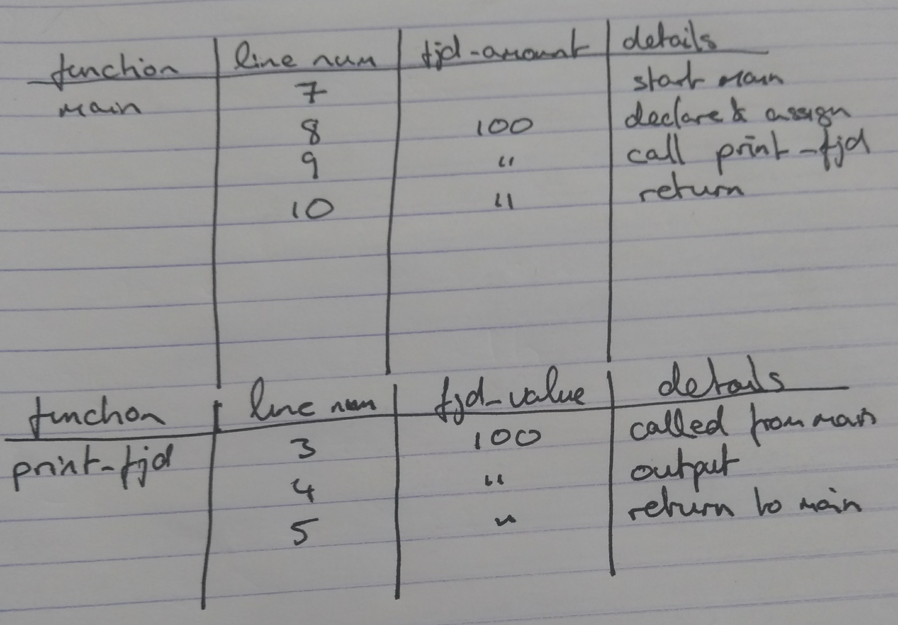

# Branching Computation

## Objective

We want to introduce multiple decision points into our computations.

## Static Structure

So far we have only written straight line code.  This is code that starts, executes each line sequentially, and ends.  Take a cut down version of the example from our previous chapter:

```{.cpp .numberLines}
#include <iostream>

void print_fjd(int fjd_value) {
  std::cout << "FJD$" << fjd_value << " is EUR" << (fjd_value * 0.4076) << std::endl;
}

int main() {
  int fjd_amount = 100;
  print_fjd(fjd_amount);
  return 0;
}
```

This code can be represented as two **flowcharts**.

{@fig:straight-line-code}

In figure @fig:straight-line-code we see a representation of the `main` function.  The `main` function starts and then immediately calls the `print_fjd` function passing in the value `100`.  In a flowchart the fact that `print_fjd` is a function call is depicted using the rectangle with double lined walls on the left and right side.  The `print_fjd` function itself has only one block of executable code, represented by the parallelogram.  In my flowchart I've summarised the operation of the code in this block rather than go into the detail about `std::cout`.

Flowcharts are an excellent tool for starting with a problem statement and breaking it down into smaller functions.  They provide a _static_ view of the structure of software.  The static view tends to ignore the values of variables and values passed to functions -- it only shows the structure of the software.  Sometimes we need a more _dynamic_ view of what is happening taking account of the values of variables.  To see this we trace the execution of the software.

## Tracing Execution

Tracing the execution of software is the process of stepping through each line of code in a concrete example.  One useful way to trace the execution of code is to start with a table drawn on paper:

|function|line number|variable name|details|
|--------|-----------|----------|-------|

For our simple program above a full trace through the program starts on line $7$.  I've traced throgh the execution of this program on paper, as seen in figure @fig:program-execution.

{@fig:program-execution}

In figure @fig:program-execution I started on line 7 and one column is called `fjd_amount` as a variable of that name appears in the `main` function.  On the next line of chode where `fjd_amount` is declared and initialised we fill in the value of the variable as `100`.  Interestingly, the next line, line $9$, calls the `print_fjd` function.  In order to trace this we draw a new grid to keep track of the value of variables in that function.

This all feels a bit overkill for such simple code.  The value of flowcharts and tracing will be seen when we introduce conditional execution.

## Conditional execution

In order to write useful programs, we almost always need the ability
to check certain conditions and change the behaviour of the program
accordingly.  Conditional statements give us this ability.  The
simplest form is the `if` statement:

```c++
  if (x > 0) {
    cout << "x is positive" << endl;
  }
```
%
The expression in parentheses is called the condition.
If it is true, then the statements in brackets get executed.
If the condition is not true, nothing happens.

\index{operator!comparison}
\index{comparison!operator}

The condition can contain any of the comparison operators:

```c++
x == y  // x equals y
x != y  // x is not equal to y
x > y   // x is greater than y
x < y   // x is less than y
x >= y  // x is greater than or equal to y
x <= y  // x is less than or equal to y
```

Although these operations are probably familiar to you, the
syntax C++ uses is a little different from mathematical
symbols like $=$, $\neq$ and $\le$.  A common error is
to use a single `=` instead of a double `==`.  Remember
that `=` is the assignment operator, and `==` is
a comparison operator.  Also, there is no such thing as
`=< or `=>`.

The two sides of a condition operator have to be the same
type.  You can only compare `int` to `int` and
`float` to `float`.  Unfortunately, at this
point you can't compare `string`s in this manner!  There is
a way to compare `string`s, but we won't get to it for a couple
of chapters.

## Alternative execution

A second form of conditional execution is alternative execution,
in which there are two possibilities, and the condition determines
which one gets executed.  The syntax looks like:

```c++
  if (x%2 == 0) {
    cout << "x is even" << endl;
  } else {
    cout << "x is odd" << endl;
  }
```

If the remainder when `x` is divided by 2 is zero, then
we know that `x` is even, and this code displays a message
to that effect.  If the condition is false, the second
set of statements is executed.  Since the condition must
be true or false, exactly one of the alternatives will be
executed.

As an aside, if you think you might want to check the parity
(evenness or oddness) of numbers often, you might want to
"wrap" this code up in a function, as follows:

```c++
void printParity (int x) {
  if (x%2 == 0) {
    cout << "x is even" << endl;
  } else {
    cout << "x is odd" << endl;
  }
}
```

Now you have a function named `printParity` that will display
an appropriate message for any integer you care to provide.
In `main` you would call this function as follows:

```c++
  printParity (17);
```

Always remember that when you `call` a function, you do
not have to declare the types of the arguments you provide.
C++ can figure out what type they are.  You should resist the
temptation to write things like:

```c++
  int number = 17;
  printParity (int number);         // WRONG!!!
```


Sometimes you want to check for a number of related conditions
and choose one of several actions.  One way to do this is by
**chaining** a series of `if`s and `else`s:

```c++
  if (x > 0) {
    cout << "x is positive" << endl;
  } else if (x < 0) {
    cout << "x is negative" << endl;
  } else {
    cout << "x is zero" << endl;
  }
```

These chains can be as long as you want, although they can
be difficult to read if they get out of hand.  One way to
make them easier to read is to use standard indentation,
as demonstrated in these examples.  If you keep all the
statements and squiggly-braces lined up, you are less
likely to make syntax errors and you can find them more
quickly if you do.

In addition to chaining, you can also nest one conditional
within another.  We could have written the previous example
as:

```c++
  if (x == 0) {
    cout << "x is zero" << endl;
  } else {
    if (x > 0) {
      cout << "x is positive" << endl;
    } else {
      cout << "x is negative" << endl;
    }
  }
```

There is now an outer conditional that contains two branches.  The
first branch contains a simple output statement, but the second
branch contains another `if` statement, which has two branches
of its own.  Fortunately, those two branches are both output
statements, although they could have been conditional statements as
well.

Notice again that indentation helps make the structure
apparent, but nevertheless, nested conditionals get difficult to read
very quickly.  In general, it is a good idea to avoid them when you
can.

On the other hand, this kind of **nested structure** is common, and
we will see it again, so you better get used to it.

## What we can now do

We can now branch our computations:

```c++
#include <iostream>

int read_int() {
  int val;
  std::cin >> val;
  std::cout << "You input the value " << val << std::endl;
}

int main() {
  int fjd_amount;

  std::cout << "Please enter an amount in FJD for conversion to EUR: ";
  fjd_amount = read_int();

  if(fjd_amount < 0) {
    std::cout << "You have entered an invalid amount" << std::endl;
  } else {
    std::cout << "FJD$" << fjd_amount << " is worth EUR" << (fjd_amount * 0.4076) << std::endl;
  }
}